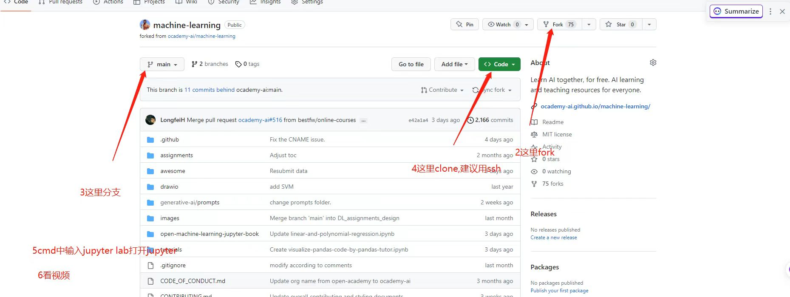
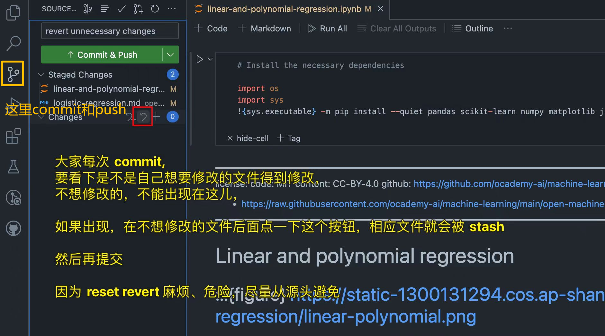

# Table of Contents
1. [总体任务说明](#general-mmission-statement)
2. [How to do the assignments](#how-to-do-the-assignments)
   1. [视频教程](#video-tutorial)
   2. [文字教程](#word-tutorial)
3. [COS](#cos)
   1. [常见问题的视频讲解](#common-question)
4. [环境配置](#environment-configuration)
   1. [本地配置](#local-configuration)
   2. [虚拟机环境](#virtual-machine-environment)
5. [Build书本](#build)
6. [审核PR](#pr)
7. [Google Colab](#google-colab)
8. [如何找资料](#find-information)
   1. [Kaggle](#kaggle)
   2. [GitHub](#github)
   3. [Visualization](#visualization)
9.[jupyterbook教程](#jupyterbook-tutorials)
   1. [构建目录](#structure-the-table-of-contents)
   2. [插入图片](#images-and-figures)
10. [个人小记(可忽略)](#personal-note)
   1. [添加远程仓库](#remote-repository)
   2. [创建branch再提交](#create-branch)
   3. [回退commit](#commit)
   4. [同步本地仓库](#sync)
   5. [Branch操作](#check-branch)
   6. [vscode快捷键](#vscode)


# ocademy-how-to-ramp-up
##  1. <a name='general-mmission-statement'></a>总体任务说明
1. 我们的主线目标是建成我们的[开源书](https://press.ocademy.cc/intro.html)
2. 小任务包括将他人开源仓库添加至我们的仓库，增加可视化内容，修复bug等
3. 请各位同学在[project](https://github.com/ocademy-ai/machine-learning/projects?query=is%3Aopen)里查看自己的任务，提交pr后进行关联（在pr右侧的development输入issue编号，更改状态）
4. 目前资源请全部放至COS云端
5. 关于github操作，请参考[陈伦德老师的视频](https://www.bilibili.com/video/BV1qv4y1R7L7/?spm_id_from=333.999.0.0)或者在网上寻找相关资源
6. 建书的相关流程请参考[contributing](https://github.com/ocademy-ai/machine-learning/blob/main/CONTRIBUTING.md)
7. 有问题随时在群内询问，不要卡在那里好久耽误整体任务进度

##  2. <a name='how-to-do-the-assignments'></a>How to do the assignments
我们将对[machine-learning仓库](https://github.com/ocademy-ai/machine-learning)(upstream)做出贡献，而在[Ocademy网站](https://press.ocademy.cc/intro.html)可以查看文件的渲染效果

[STYLE_GUIDE.md](https://github.com/ocademy-ai/machine-learning/blob/main/open-machine-learning-jupyter-book/STYLE_GUIDE.md)文件给出了构建书本的风格规范，如果任务中某文件在jupyter lab里渲染不成功，可以查阅该文件给出的格式规范

###  2.1. <a name='video-tutorial'></a>视频教程
[中文版](https://www.bilibili.com/video/BV1uW4y1s7Ci)和[英文版]( https://www.bilibili.com/video/BV1nM41167j9)教程自行选择观看

###  2.2. <a name='word-tutorial'></a>文字教程
首先需要fork一个自己的仓库(origin)，再创建一个新的分支，对该分支提交`commit`，最后从自己的仓库提交`Pull Request`到machine-learning仓库


关于Github Pull Request，参考Lunde老师[系列视频](https://space.bilibili.com/472463946/channel/collectiondetail?sid=917876)

>**notice**
>
>每次提交PR，不要直接从main分支提交，最好创建一个分支，从该分支提交
>
>It's better that you submit your PR from another branch than main.

##  3. <a name='cos'></a>COS
先下载[COSBrowser](https://cloud.tencent.com/document/product/436/11366),再查看[COS视频教程](https://netdisk-1300131294.cos.ap-shanghai.myqcloud.com/Tutorial-lunde-tencent-cos-storage.mp4)，`SecretId`和`SecretKey`请查看群公告，同时多关注群公告的注意事项

###  3.1. <a name='common-question'></a>常见问题的视频讲解
- [学院GPU的使用1](https://netdisk-1300131294.cos.ap-shanghai.myqcloud.com/Ocademy/Tutorials/GPU%20server%20400.mp4)
- [学院GPU的使用2](https://netdisk-1300131294.cos.ap-shanghai.myqcloud.com/Ocademy/Tutorials/xining-zhu-DL%20assignment%20%26%20GPU.mp4)
- [md文件转化为ipynb文件](https://netdisk-1300131294.cos.ap-shanghai.myqcloud.com/Ocademy/Tutorials/xusenbo-how-to-transform-md-to-ipynb.mp4)
- [如何从tensorflow和sklearn中获取数据](https://netdisk-1300131294.cos.ap-shanghai.myqcloud.com/Ocademy/Tutorials/Huang%20Longfei%20-%20how%20to%20fetch%20dataset%20from%20sklearn%20and%20tensorflow.mp4)
- [Jupyter Notebook附加图像元数据](https://netdisk-1300131294.cos.ap-shanghai.myqcloud.com/Ocademy/Tutorials/Huang%20Longfei%20Jupyter%20Notebook%20attach%20image%20metadata.mp4)
- [Markdown文件格式要求](https://netdisk-1300131294.cos.ap-shanghai.myqcloud.com/Ocademy/Tutorials/Lunde%20Chen%20-%20format-python-code-in-md-files.mp4)
- [js嵌入iframe-1](https://netdisk-1300131294.cos.ap-shanghai.myqcloud.com/Ocademy/Tutorials/Lunde%20Chen%20-%20jupyterbook%20include%20js%20html%20iframe.mp4)
- [js嵌入iframe-2](https://netdisk-1300131294.cos.ap-shanghai.myqcloud.com/Ocademy/Tutorials/Lunde%20Chen%20-%20jupyterbook%20include%20js%20html%20iframe%202.mp4)
- [js嵌入iframe-3](https://netdisk-1300131294.cos.ap-shanghai.myqcloud.com/Ocademy/Tutorials/Lunde%20Chen%20-%20jupyterbook%20include%20js%20html%20iframe.mp4)
- [本地build书本(sh)](https://netdisk-1300131294.cos.ap-shanghai.myqcloud.com/Ocademy/Tutorials/Lunde-Tutorial-Windows-sh-build-local.sh.mp4)
- [嵌入cnn](https://netdisk-1300131294.cos.ap-shanghai.myqcloud.com/Ocademy/Tutorials/lundechen-iframe-cnn-explainer-tutorial.mp4)
- [Github actions用法](https://netdisk-1300131294.cos.ap-shanghai.myqcloud.com/Ocademy/Tutorials/lunde-use-github-actions-for-testing.mp4)
- [如何review pr](https://netdisk-1300131294.cos.ap-shanghai.myqcloud.com/Ocademy/Tutorials/Lunde_Chen_How_to_review_JupyterBook.mp4)
- [如何嵌入可视化内容-1](https://netdisk-1300131294.cos.ap-shanghai.myqcloud.com/Ocademy/Tutorials/xinning-zhu-how-to-iframe-tensorflow-playground.mp4)
- [如何嵌入可视化内容-2](https://netdisk-1300131294.cos.ap-shanghai.myqcloud.com/Ocademy/Tutorials/lundechen-zhuxinning-tf-playground.mp4)
- [利用jupyter-lab](https://netdisk-1300131294.cos.ap-shanghai.myqcloud.com/Ocademy/Tutorials/lundechen-zhuxinning-tf-playground.mp4)

项目用到的dataset、css/js等文件都需要放在COS，许多教程视频也放在了COS，自主摸索查看这些视频

##  4. <a name='environment-configuration'></a>环境配置
###  4.1. <a name='LocalConfiguration'></a>本地配置
环境配置请参考[CONTRIBUTING.md](https://github.com/ocademy-ai/machine-learning/blob/main/open-machine-learning-jupyter-book/CONTRIBUTING.md),该文件也提供了常见error的解决，遇到问题多参考

推荐使用ssh克隆代码至本地(local): `git clone git@github.com:ocademy-ai/machine-learning.git`

如果你还没有配置ssh,参考以下方法将默认的git安装方式更改为ssh
>1. 打开终端或命令行工具，输入以下命令以检查您当前的git配置：
>  ```
>  git config --list
>  ```
>2. 如果您看到以下输出，请跳到第4步：
>  ```
>  user.name=Your Name
>  user.email=your.email@example.com
>   ```
>   否则，请继续执行以下步骤。
>
>3. 设置您的用户名和电子邮件地址：
>   ```
>  git config --global user.name "Your Name"
>  git config --global user.email "your.email@example.com"
>  ```
>4. 更改git的默认传输协议为ssh：
>   ```
>  git config --global url."git@github.com:".insteadOf "https://github.com/"
>   ```
>现在，您应该能够使用ssh协议从GitHub安装软件包了。

###  4.2. <a name='virtual-machine-environment'></a>虚拟机环境
本地环境配不好可以使用虚拟机镜像，里面的环境已为我们配置好了，可以直接用来 build 我们的书，也可以直接访问 Google

配有[视频](https://netdisk-1300131294.cos.ap-shanghai.myqcloud.com/vwware/VMWare-VM-build-ready-video.mp4)，视频中的相关文件存放在COS中的`netdisk-1300131294/vwware`文件夹下

##  5. <a name='build'></a>Build书本
四种build书本的方法，其中本地build书本没有提供视频教程，[虚拟机](https://netdisk-1300131294.cos.ap-shanghai.myqcloud.com/vwware/VMWare-VM-build-ready-video.mp4)、[Docker](https://netdisk-1300131294.cos.ap-shanghai.myqcloud.com/Ocademy/Tutorials/xusenbo-wsl2-docker-install-and-connect-to-vscode.mp4)和[Github Action](https://netdisk-1300131294.cos.ap-shanghai.myqcloud.com/Ocademy/Tutorials/lunde-use-github-actions-for-testing.mp4)提供了视频教程

##  6. <a name='pr'></a>审核PR
如何审核其他人的PR，参考Lunde老师的[review Assignments](https://netdisk-1300131294.cos.ap-shanghai.myqcloud.com/Ocademy/Tutorials/Lunde_Chen_How_to_review_Assignments.mp4)和[review JupyterBook](https://netdisk-1300131294.cos.ap-shanghai.myqcloud.com/Ocademy/Tutorials/Lunde_Chen_How_to_review_JupyterBook.mp4)这两个视频

##  7. <a name='google-colab'></a>Google Colab
[Google Colab](https://colab.research.google.com/)是一个免费的基于云端的Jupyter笔记本环境，为研究者提供一定免费的GPU，不需要什么设置与环境配置

我们现在的每个notebook都是可以单独运行的，因此在我们笔记本没有GPU的情况下可以利用Google Colab提供的免费GPU运行notebook

##  8. <a name='find-information'></a>如何找资料

###  8.1. <a name='kaggle'></a>Kaggle

Kaggle 有很多不错的

###  8.2. <a name='github'></a>GitHub

License 友好程度：MIT > Apache 2.0 > GNU。其他的遇到了在群里讨论

e.g. 

https://github.com/yandexdataschool/Practical_DL

https://github.com/yandexdataschool/Practical_DL/tree/fall22

https://github.com/rmsouza01/deep-learning/tree/master

https://github.com/aeturrell/coding-for-economists/tree/main

https://github.com/Nyandwi/machine_learning_complete/tree/main

https://github.com/trekhleb/machine-learning-experiments

###  8.3. <a name='visualization'></a>Visualization

常见可视化的资源搜索途径：
- 用谷歌搜索 xxx playground, xxx visualization, xxx animation, etc
譬如这些网站
[machine leaning playground](https://ml-playground.com/)
[Neurual Network playground](https://playground.tensorflow.org/#activation=tanh&batchSize=10&dataset=circle&regDataset=reg-plane&learningRate=0.03&regularizationRate=0&noise=0&networkShape=4,2&seed=0.97132&showTestData=false&discretize=false&percTrainData=50&x=true&y=true&xTimesY=false&xSquared=false&ySquared=false&cosX=false&sinX=false&cosY=false&sinY=false&collectStats=false&problem=classification&initZero=false&hideText=false),之后如何嵌入开源书中查看[视频1](https://netdisk-1300131294.cos.ap-shanghai.myqcloud.com/Ocademy/Tutorials/lundechen-zhuxinning-tf-playground.mp4)
[视频2](https://netdisk-1300131294.cos.ap-shanghai.myqcloud.com/Ocademy/Tutorials/xinning-zhu-how-to-iframe-tensorflow-playground.mp4)

## 9. <<a name='jupyterbook-tutorials'></a>jupyterbook教程

### 9.1. <a name='structure-the-table-of-contents'></a>构建目录

对应machine-learning仓库的_toc.yml文件，对书本目录进行操作查阅jupyterbook的[构建目录]( https://jupyterbook.org/customize/toc.html)和[配置目录](https://jupyterbook.org/en/stable/structure/configure.html)教程

### 9.2 <a name='images-and-figures'></a>插入图片

jupyterbook教程提供了几种在文件中[插入图片](https://jupyterbook.org/en/stable/content/figures.html)的方法，
我们使用的模板如下：
> ```
> :::{figure} path/to/your/figure/file
> ---
> name: 'figure_label'
> width: 90%
> ---
> Caption for the figure (markdown is supported for hyperlinks, references, etc.)
> :::
> ```

## 10. <a name='personal-note'></a>个人小记(可忽略)

###  10.1. <a name='remote-repository'></a>添加远程仓库
`git remote add origin git@github.com:Nicole-ying/machine-learning.git` 自己的远程仓库命名为origin

`git remote add upstream git@github.com:ocademy-ai/machine-learning.git` machine-learning仓库命名upstream

`git remote -v` 查看远程仓库地址

###  10.2. <a name='create-branch'></a>创建branch再提交
在本地仓库创建一个新的分支，在新的分支上进行操作，再push到远程仓库

`git checkout -b branchname` 创建本地仓库的分支



###  10.3. <a name='commit'></a>回退commit
`git log` 查看日志，复制需要回退的commit号，q退出日志

`git reset commit号` 返回至该commit的本地提交

`git push origin main --force` 用本地仓库覆盖对远程仓库的提交，完成回退 (与本地仓库保持一致)

###  10.4. <a name='sync'></a>同步本地仓库
`git stash` 保存目前更新

`git pull origin/upstream` 本地仓库同步远程仓库/machine-learning仓库

`git stash pop` 恢复目前的更新

###  10.5. <a name='check-branch'></a>Branch操作
`git branch` 查看本地仓库的所有分支

`git branch -r` 查看远程仓库的所有分支

`git branch -d branchname` 删除本地仓库的分支

`git branch -d -r branchname(带origin/)` 删除远程仓库的分支 (-d强制删除)

`git checkout branckname` 切换分支

`git checkout -b branchname` 新建本地分支

###  10.6. <a name='vscode'></a>vscode快捷键
`ctrl+shift+p` 输入查找

`ctrl+~` 打开终端

`ctrl+f` 查找文件内容文件 (内容部分)

`ctrl+shift+f` 查找整个项目文件 (目录部分)